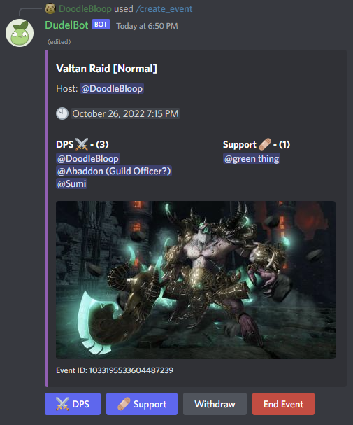
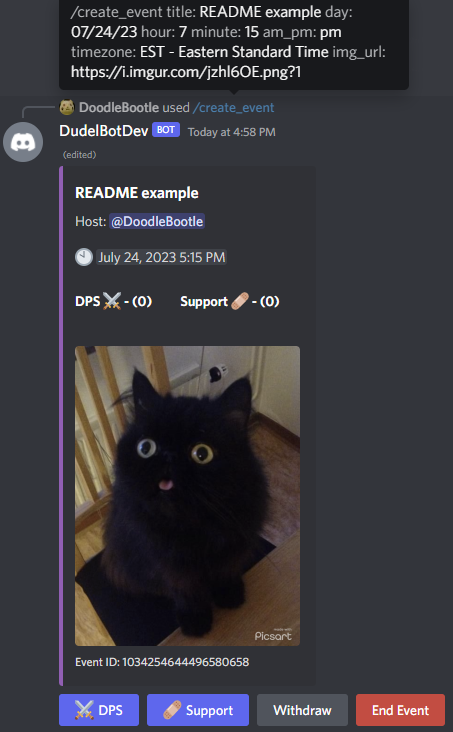
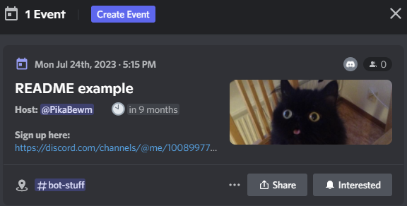
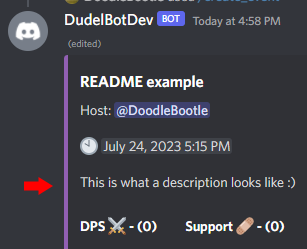
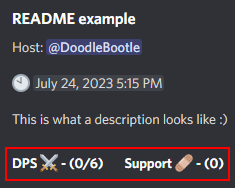
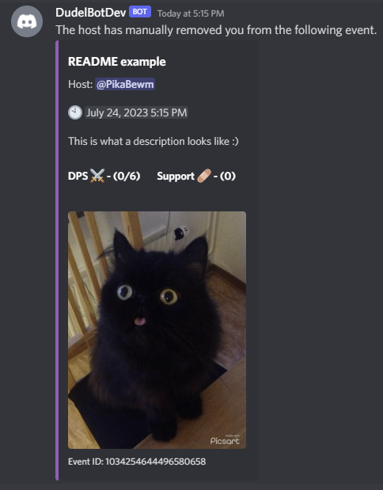
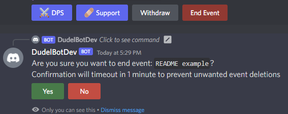
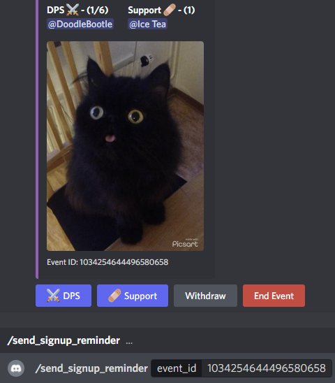

# DudelBot
A Discord bot for hosting events in the massively multiplayer online role-playing game (MMORPG),
[Lost Ark](https://www.playlostark.com/en-us).

## Overview
DudelBot aims to allow for the easy creation and management of events in regards to Lost Ark. Event hosters
can create events with a single command and can modify most parameters of any created events. Support for 
default raids in the game are implemented and intuitive UI components are included for both host and attendee
usability.

## Table of Contents
* [Features](#features)
* [Setup](#setup)
    * [Prerequisites](#prerequisites)
    * [Steps](#steps)

## Features
* Event creation, deletion, and cancellation
* UI buttons for attendee sign up and withdraws
* Custom image support through image link or file upload
* Default image support for the following in-game raids: Argos, Brelshaza, Kakul-Saydon, Valtan, and Vykas
* Timezone support so event times display relative to the user
* Modification of event title, description, date, time, and image
* Event attendee signup limits
* Automatic deletion of expired events
* Attendee signup removals
* Remind attendees about an event by mentioning/pinging event attendees
* Lists events that a user is sign up for
* Creates Discord scheduled events for increased visibility towards DudelBot events
* Custom help command
* Permission checks for event creation and modification commands

## Technologies Used
* Python
* SQLite
* Latest development branch of [discord.py](https://github.com/Rapptz/discord.py/tree/v2.0.0)

## Setup
### Prerequisites
1. A Discord [account](https://discord.com/register)
2. A Discord [server](https://support.discord.com/hc/en-us/articles/204849977-How-do-I-create-a-server-) where your Discord account has the "Manage Server" permission

### Steps
1. Click this link to start inviting DudelBot to your Discord server: [Invite DudelBot](https://discord.com/api/oauth2/authorize?client_id=1008997047426363472&permissions=10737544192&scope=bot)
2. In the "ADD TO SERVER" dropdown, select the server you would like to invite DudelBot to, then click "Continue"
3. Ensure all permissions are checked, then click "Authorize"
4. Choose a text channel in your server where you want DudelBot to create and check for events. Run the /set_events_channel command in the chosen text channel.
5. Run the /help command to get familiar with DudelBot's commands and run the /create_event command to create your first DudelBot event! 

## How to Use DudelBot
### Sections
* [Creating events](#creating-events)
* [Editing events](#editing-events)
* [Joining events](#joining-events)
* [Ending events](#ending-events)
* [Other commands](#other-commands)
* [Command index](#command-index)

### Creating events
Associated commands:
* /create_event

Create an event using the /create_event command. Fill out the required title, day, hour, minute, and am_pm parameters to specify an event name, date, and time. Format for the day parameter is MM/DD/YY.

If desired, the optional image (local upload) or image_url (online link) parameters can be used to specify a custom image for the event. Do not use both the image and the img_url parameters at the same time. There is also an optional timezone parameter if the host is running the command from outside DudelBot's default time zone of PST/PDT.

The /create_event command creates a DudelBot event and a Discord scheduled event with a link to the Dudelbot event for increased visibility.
| DudelBot Event | Scheduled Event |
|   :---------:  |  :-----------:  |
|  |  |

### Editing events
Associated commands:
* /edit_description
* /edit_image
* /edit_time
* /edit_title
* /limit_signups
* /remove_signup

All commands in this section require an event_id parameter which can be found in the footer of each DudelBot message. The /edit_image, /edit_time, and /edit_title commands have parameters that are identical to what is described in the [Creating an event](#creating-an-event) section.

The /edit_description command allows a host to add a description to the DudelBot event.

The /limit_signups command allows a host to choose a limit on the amount of DPS and support sign ups that an event can have. The command has required parameters for both DPS and support, but a host can enter -1 for either parameter if they do not want that role to be limited. If there are currently more signups for a role than the command limit input, the latest attendees past the limit will be removed and the removed attendees will be notified through direct message.

As a host, use the /remove_signup command to forcibly remove an attendee from the signups. The user will be notified through a direct message from the bot.  

### Joining events
Associated commands:
* None

Simply use the "DPS" and "Support" buttons below any DudelBot event to sign up for the corresponding event. If you no longer want to be signed up to the event, click the "Withdraw" button.

### Ending events
Associated commands:
* /cancel_event
* /end_event

Both of these commands are very similar. They both take only an event_id parameter. The only difference is that /cancel_event will alert all attendees through a direct message that the event has been cancelled whereas /end_event silently deletes the event. There is also an "End Event" button under each DudelBot event for ease of use as ending an event is the feature that is used more often than cancelling an event.

### Other commands
Associated commands:
* my_signups
* player_signups
* send_signup_reminder

Use /my_signups to send yourself a direct message containing all of your DudelBot event signups. Use /player_signups to send yourself a direct message containing all of the DudelBot event signups of another user.

/send_signup_reminder is used to easily mention all attendees of a DudelBot event with a reminder message stating that they are signed up for that event.  

### Command index
* [/cancel_event](#ending-events)
* [/create_event](#creating-events)
* [/edit_description](#editing-events)
* [/edit_image](#editing-events)
* [/edit_time](#editing-events)
* [/edit_title](#editing-events)
* [/end_event](#ending-events)
* [/help](#steps)
* [/limit_signups](#editing-events)
* [/my_signups](#other-commands)
* [/player_signups](#other-commands)
* [/remove_signup](#editing-events)
* [/send_signup_reminder](#other-commands)